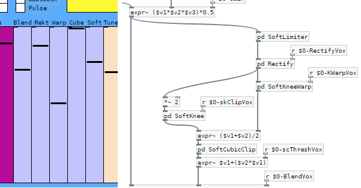
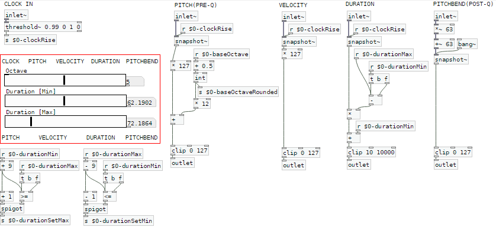

# Waveshape-Synth - Waveshaping Polyphonic Synthesizer #
An 8-voice polyphonic audio synthesizer with per-voice oscillator waveshaping created as a collection of Pure Data subpatches. Compatible with [Pd-Vanilla](https://puredata.info/downloads/pure-data) and [Automatonism](https://www.automatonism.com/). It was inspired by [wavedist](https://github.com/vulcu/wavedist) and uses the same waveshaping algorithms.

## Table of Contents ##
* [General Info](#general-info)
* [Features](#features)
* [Automatonism](#automatonism)
* [Installation](#installation)
* [Algorithms](#algorithms)
* [References](#references)

## General Info
This project is a synthesizer not quite like any other. It relies on a handful of waveshaping algorithms to produce differing kinds of overdrive and distortion from the oscillators of each synthesizer voice, and then applies an ADS-envelope low-pass filter to each voice on an individual basis. The harmonic ratios and the balance between even and odd harmonics varies by algorithm, with some sounding better than others for certain oscillator and envelope combinations. There's no hard-and-fast rules here, so just use your ears.



The goal of this project is to provide a quick and simple way for a user to dial in rich, complex synth sounds without needing to know much about synthesizers. Unlike the [wavedist](https://github.com/vulcu/wavedist) plugin, all the waveshapers are active at once here, allowing for some truly wild harmonic ratios.

## Features ##
* 1, 2, 4, or 8 Voices
* 7 Oscillators, 1 ADSR, and 2 ADS envelopes per-voice
* Oscillators selectable between Sine, Saw, and a PWM with a 5%-50% automatable duty-cycle
* 6 different waveshaping algorithms and a Gain control
* Unison control (oscillator de-tune)
* Bit depth control/crush range of 1-12 bits
* Portamento control (monophonic only)
* Automatonism interface allowing Clock and Pitch signals to control note on/off, PWM depth, and more

Typical implementation within a Pure-Data environment might look like this (from `example.pd`):


#### To Do ####
* No new features planned but open to requests

#### Status: This project is active but considered completed ####

## Automatonism ##
This project is intended to be usable with [Automatonism](https://www.automatonism.com/the-software) and the `Waveshape-Automatonism.pd` patch may be used to interface Waveshape-Synth with Automatonism sub-patches and control signals.



## Installation ##
To use this project, install it locally and open it with Pure Data or Purr Data. It intended to be compatible with the vanilla distribution of Pure Data should not require additional dependencies (if this isn't the case then please let me know).

## Algorithms ##
This project uses the following algorithms for waveshaping and signal limiting:
```
 1) soft clip alg:        y[n] = (1.5*x[n]) - (0.5*x[n]^3);
 2) leaky integrator alg: y[n] = ((1 - A) * x[n]) + (A * y[n - 1]);
 3) soft knee clip alg:   y[n] = x[n] / (K * abs(x[n]) + 1);
 4) cubic soft clip alg:  y[n] = (1.5 * threshold * HardClip(x[n])) -
                                ((0.5 * HardClip(x[n])^3) / threshold);
 5) warp alg: y[n] = (((x[n] * 1.5) - (0.5 * x[n]^3)) * (((2 * K) / (1 - K))
                    + 1)) / ((abs((x[n] * 1.5) - (0.5 * x[n]^3)) 
                    * ((2 * K) / (1 - K))) + 1);
 6) rectify alg: y[n] = ((1 - R) * softclip(x[n])) + (|softclip(x[n])| * R);
```

## References: ##
1)  Aarts, R.M., Larsen, E., and Schobben, D., 2002, 'Improving Perceived Bass and Reconstruction of High Frequencies for Band Limited Signals' Proc. 1st IEEE Benelux Workshop MPCA-2002, pp. 59-71
 2) Arora et al., 2006, 'Low Complexity Virtual Bass Enhancement Algorithm for Portable Multimedia Device' AES 29th International Conferance, Seoul, Korea, 2006 September 2-4
 3) Gerstle, B., 2009, 'Tunable Virtual Bass Enhancement', [ONLINE] <http:rabbit.eng.miami.edu/students/ddickey/pics/Gerstle_Final_Project.pdf>
 4) Yates, R. and Lyons, R., 2008, 'DC Blocker Algorithms' IEEE Signal Processing Magazine, March 2008, pp. 132-134

## ##
(C) 2017-2021, Winry R. Litwa-Vulcu
